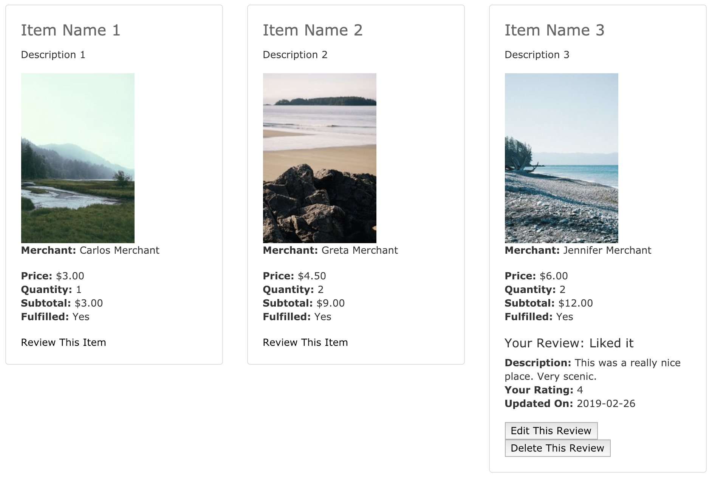
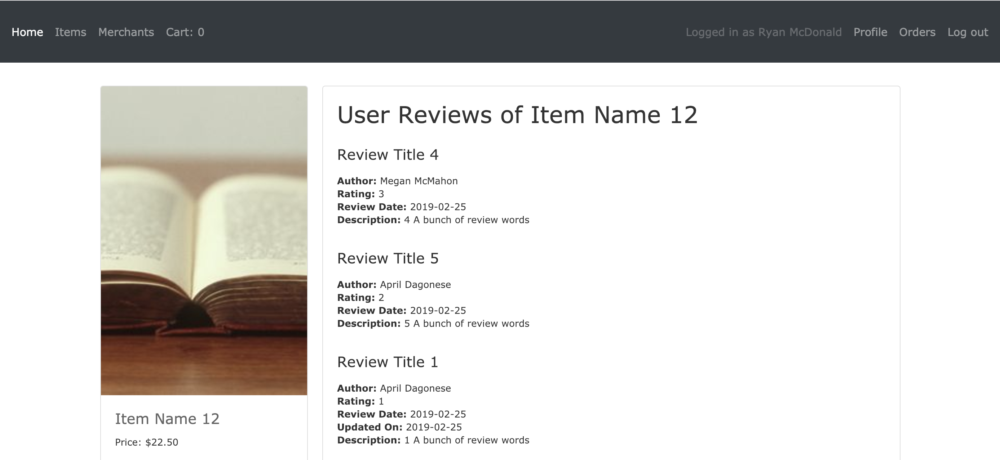
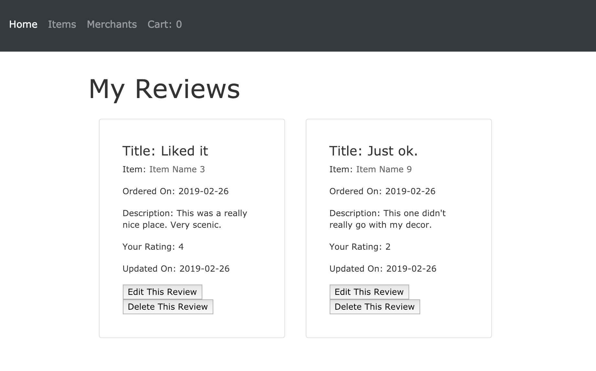
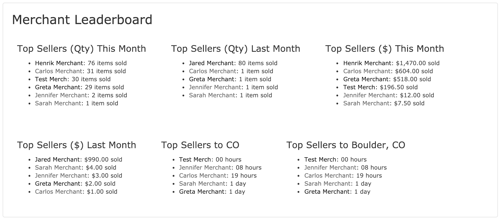
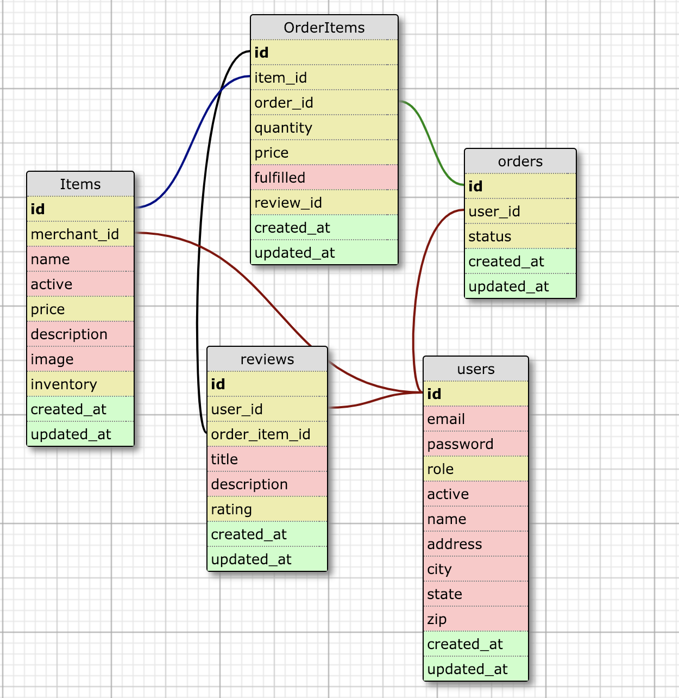

# README

## Little Shop Extensions
Little Shop Extensions is a solo project developed as part of Backend Mod 2 at the Turing School of Software and Design. The assignment was to expand upon the functionality developed in the previous project, Little Shop, in which students created a fictitious e-commerce platform where users could register to place items into a shopping cart and 'check out'. Each student was assigned 2 from a variety of extensions to add. This particular project built out the following:
  1. User Reviews: Users will have the ability to leave ratings for items they have successfully purchased.
  2. More Merchant Statistics: Build a Merchant leaderboard as part of the "/merchants" page containing additional statistics that all users can see.

## Motivation
Mod 2 of the backend program trains students to build out web applications in Ruby. Specific goals of the Little Shop Extensions project included: advanced Rails routing, including nested resources and namespacing; advanced ActiveRecord usage; practice with HTML and CSS; use of session management; as well as authentication, authorization, and separation of user roles and permissions.

## User Reviews
User Reviews are now accessible via a user's profile order show page:

As well as on the show page of the item itself:

Additionally, there is now a "My Reviews" link on the user's Profile page, which allows them to view and edit the reviews they've written for all items:

## More Merchant Statistics
The Merchants Index page now houses a "Merchant Leaderboard" section containing 6 new statistics, 2 of which are only available to registered users ("Top Sellers to My State" and "Top Sellers to My City").

## Database Schema
The implementation of User Reviews required moderate changes to the database, with a new "Reviews" table linking to both Users and OrderItems:

## Tech/framework used
<b>Built with</b>
- [Ruby on Rails](https://rubyonrails.org/)

## Installation
Little Shop of Hors d'Oeurves was built on Rails 5.1.6.1 and using PostgreSQL. It runs using 'bcrypt' for authentication. Please ensure that local environments are compatible before cloning down.

Installation Steps:
1. Fork and clone the repository at https://github.com/aprildagonese/little_shop
2. Run `bundle install`
3. Run `rake db:{create,migrate,seed}`
4. To run locally in development mode, run `rails s` in your terminal; then go to `localhost:3000` in your browser.

## Tests
All tests were built using RSpec and Capybara, with FactoryBot implemented for seed data.

To run the tests, simply clone down the repository and run the command: `rspec`

Tests are divided by models and features, with feature tests generally sub-divided by user view. Little Shop of Hors d'Oeuvres is proud to operate with 100% test coverage of all models, and we ask contributors to help us maintain this standard.

## How to use?
We provide demo accounts to help users explore the application. Please use the following accounts to log in. All accounts use the test password: `test`
- `user@test.com`
- `merchant@test.com`

## Contribute
To contribute to Little Shop, please fork the repository at https://github.com/aprildagonese/extensions_little_shop and make a pull request back to the original repo.

## Credits
The developers of Little Shop Extensions would like to thank their instructors, Ian Douglas and Megan McMahon, for their help and support in the completion of the project.
